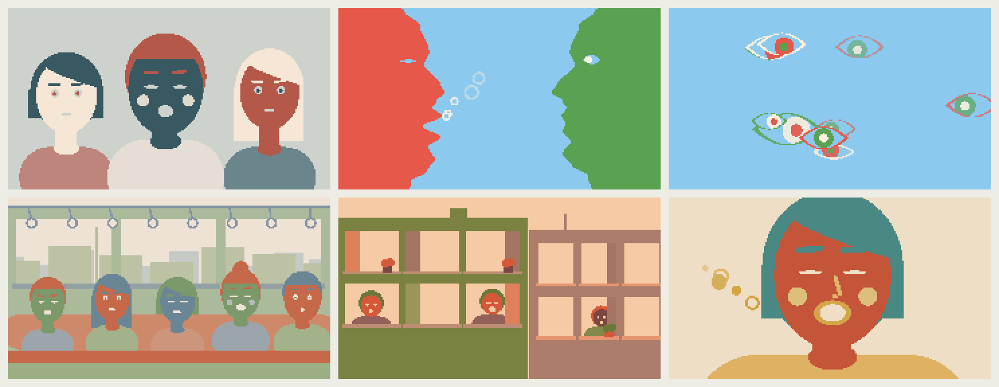
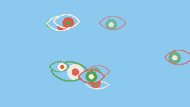
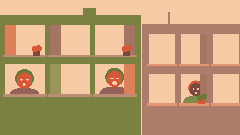

# Rill Voice

**rill** /rɪl/ *noun*: a small stream or a tiny, shallow channel cut into soil by running water.

A generative vocal instrument for the **M5Stack StickS3**. Six synthesized singers (alto, bass, choir, falsetto, tenor and vocoder) sing evolving melodies in wordless scat and vocables such as "da di doh", "loo" and "mm", while six visuals of faces, eyes and people sing along. Tap for a new piece. Shake for a new visual.

[Play Rill Voice](https://rillsound.com/voice) · [M5Burner submission](https://burner.m5stack.com/firmware/2104980220002824193) · [Build and install](#build-and-install)

**Rill family:** [Voice](https://github.com/bruceblay/rill-voice) · [Synth](https://github.com/bruceblay/rill-synth) · [Mallet](https://github.com/bruceblay/rill-mallet) · [World](https://github.com/bruceblay/rill-world) · [Drums](https://github.com/bruceblay/rill-drums) · [Rill Sound](https://rillsound.com)

## Visuals

Six visuals, drawn separately from the singer. The device opens on Portrait; after that, a new piece or a shake picks any visual except the one showing and the one before it.

| Portrait | Trio |
| --- | --- |
|  |  |
| **Rubin** | **Eyes** |
|  |  |
| **Carriage** | **Windows** |
|  |  |

*Actual 240 × 135 renderer captures driven by the Voice engine. Regenerate with `python3 tools/screenshots.py`.*

- **Portrait**: one large face singing the lead. Brows rise with the pitch, the eyes glance toward where the melody sits and close on long notes, and breath rings drift from the lips.
- **Trio**: three singers, one to a part: the support on the left, the lead in the middle, the answer on the right.
- **Rubin**: two profiles facing, and the vase between them. The lead sings on the left and the other parts on the right.
- **Eyes**: an eye opens for each note, at a column set by pitch. They blink, look toward the newest, then close and fade back into the paper.
- **Carriage**: passengers on a commuter train, the town sliding past the windows. Three of them are the three parts and sing; the others doze or read.
- **Windows**: a street of buildings, each part a singer at a window. A part moves to a new window, chosen by pitch, when it starts a new phrase.

They are drawn in Rill's language: flat opaque shapes with hard edges on a coloured ground, with eyes and mouths cut out to show the ground. The singing drives them: the engine reports each part's mouth, so a face opens tall on "ah", thins to a slit on "ee", rounds on "oo" and closes for the "m" of "doom".

## Play

| Gesture | Action |
| --- | --- |
| Front button: tap | Generate a new piece with a new singer and visual |
| Front button: hold for about 0.65 seconds | Fade sound out or in |
| Side button: tap | Cycle volume and show the data view |
| Side button: hold | Slow the whole ensemble by 4 BPM, starting on the bar after next; below 52 it comes round to 100 |
| Shake | Select a new visual without changing the music |

Near other Rill devices (Voice, Synth, Mallet, Drums or World) it joins an ensemble over ESP-NOW with no setup: every device plays on the shared tempo and bar line, and a new piece on a Voice, Synth or Mallet proposes its key to the others. In an ensemble a tap waits for the next shared bar. See [how it works](https://github.com/bruceblay/rill-synth/blob/main/SYNC-DESIGN.md).

## Sound

The composer is the one the Rill melodic instruments share: phrases that develop, answering lines, a support part, shifting harmony, delay and room. The voice layer is formant synthesis. A glottal pulse runs through four cascaded resonators that glide from a consonant to a vowel. The consonants are all voiced ones (d, b, n, m, l), made from closure and formant motion rather than noise. The vocoder is a saw carrier through a ten-band filter bank that follows the same vowels.

Each part (lead, answer, support) is one singer, so a line is sung from note to note with a glide rather than struck. Each piece picks one set of syllables (da di doh doom, ba di bo boom, na ni no noo, la li lo loo, doo di doo doom, or ah eh oh) and a repeated phrase is sung the same way each time.

## Hardware

Built for the **M5Stack StickS3**, with ESP32-S3, 8 MB flash, display, IMU and built-in speaker. Everything is synthesized; there are no samples, so the default partition table is enough. The output is driven hard for the small speaker, and the Rill Sound browser build drives it more gently.

## Build and install

**Firmware 0.1.0** was submitted to M5Burner on September 29, 2026 and is awaiting review. The first store release is not public yet.

Install Python 3.11 or later, then run these commands from the repository root:

```sh
python3 -m venv .venv
source .venv/bin/activate
python -m pip install -r requirements-dev.txt
pio run
```

On Windows, activate with `.venv\Scripts\activate` instead. Connect the StickS3 with a USB data cable, locate its port with `pio device list`, then install:

```sh
python tools/flash.py --port YOUR_DEVICE_PORT
```

Flashing replaces the current firmware and settings.


## Develop without hardware

```sh
python tools/test.py
mkdir -p build
c++ -std=c++17 -O2 tools/render.cpp -o build/render
build/render build/voice.wav 60 42
```

Arguments are output path, seconds, seed, and optional singer (0–5: alto, bass, choir, falsetto, tenor, vocoder). `tools/visual_preview.cpp` renders one visual driven by the engine.

## Project layout

- `src/Voice.h`: the shared Rill composer with a formant-singing voice layer
- `src/Visage.h`: the six visuals, and the mouth protocol they read
- `src/main.cpp`: audio, display, buttons, motion and ensemble tasks
- `src/Ensemble.h`, `src/Radio.h`: the family's ESP-NOW ensemble sync
- `tools/`: tests, WAV rendering, visual previews, screenshots and flashing
- `tests/`: host verification of the grid, the singing and the visual choice

## Credits and license

Created by Bruce Blay.

GPL-3.0-or-later. See [LICENSE](LICENSE).
